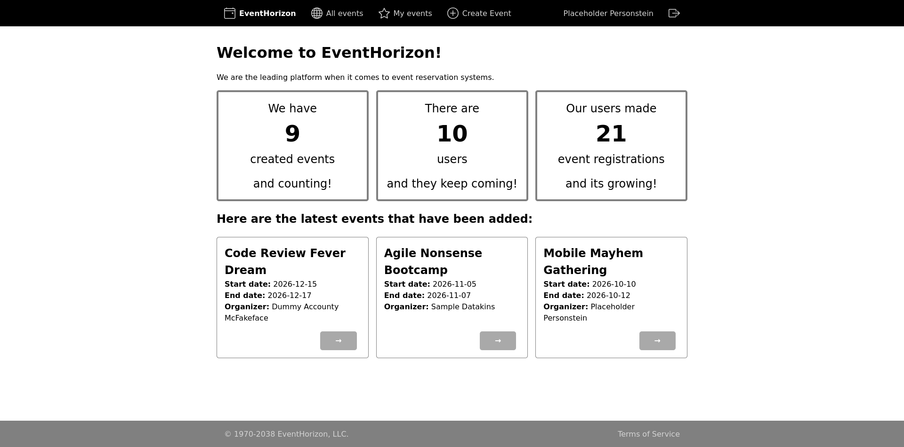
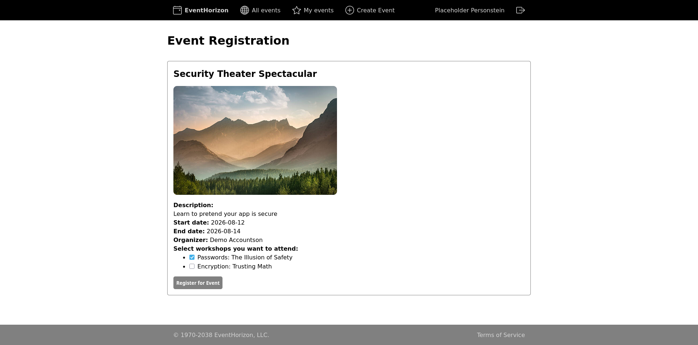

# NSWI142 Semestral project

## Demo
[The project is being temporarily hosted here!](https://webik.ms.mff.cuni.cz/~56996303/semestral-project/)

## Screenshots
### Landing Page

### Event Register Page

## Running

To build the templates and setup DB:
`./build.sh`

To run using the PHP default server:
`php -S 0.0.0.0:8000 -t public`

To **delete** all existing DB data and fill the DB with demo data:
`./use_demo_data.sh`

## Configuration

This project uses a `.env` file that gets parsed as a PHP INI file using `parse_ini_file`

To see what the `.env` file should contain there is the `.env.example` file.

The DB is assumed to be MYSQL (or fork)!

## Diviations from the user functional requirements
1. `List current user's events`
	- Also displays the users owned events (if there are any), otherwise the user would have to look through the list of all the events to find the ones they own.
	- Also shows event organizer
2. `An event detail page` + `Register for an event page`
	- If the link to event registration is only available when the user is not yet registered, then it makes no sense to put the editting of the registered workshops there.
	- Changed the cancel registration button to `Edit registration` and added a page to edit the registered workshops or cancel the registration
	- Also shows event organizer
3. User management
	- Added a password field and TOS. Both for *evil* purposes ;)

## Use of AI
1. I used AI to generate the arrays from which the demo data is generated.
2. I used AI to debug CSS and SQL problems.
3. I used AI to write the TOS.